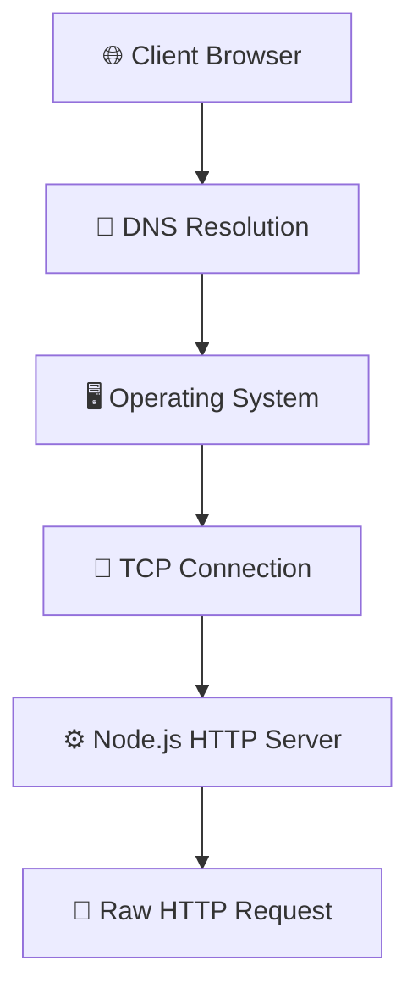
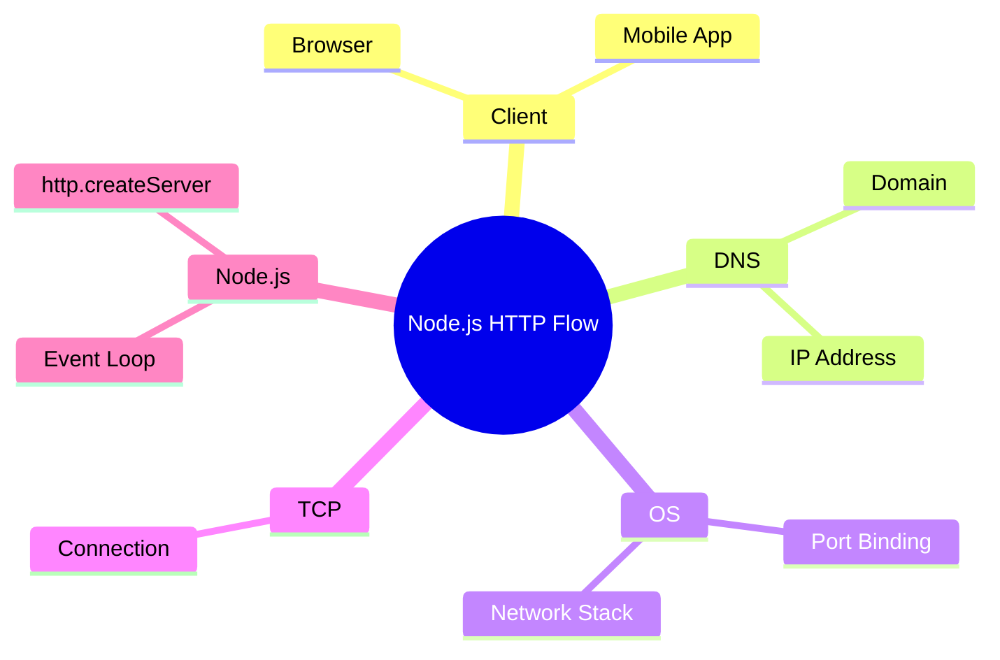
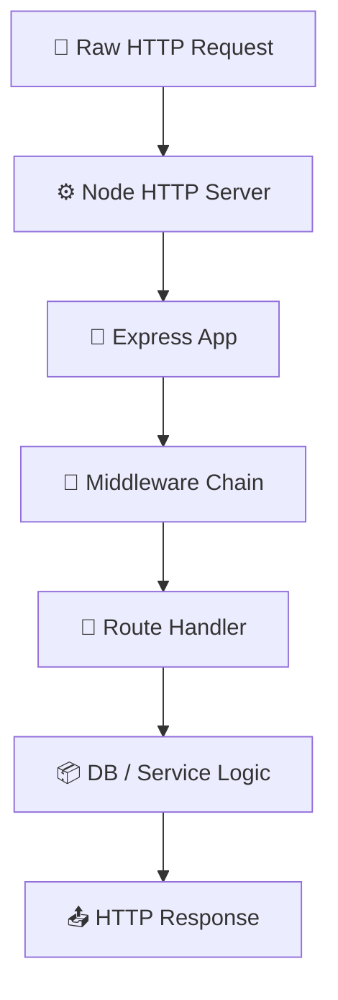
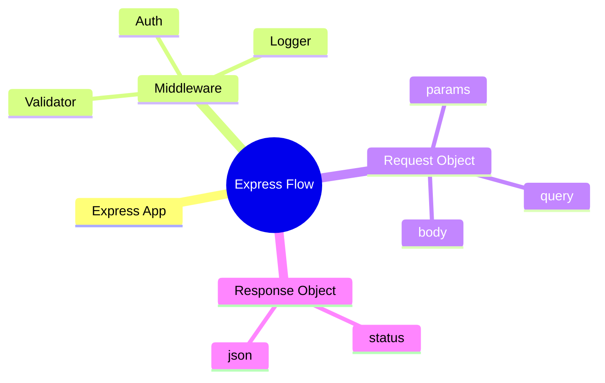

# 🔁 How a Server Handles an HTTP Request (Node.js + Express.js)

## 🧠 Big Picture (1 line)
A client request travels through DNS → OS → Node.js HTTP server → Express middleware → route logic → response back to client.

---

## ⚙️ Node.js Request Lifecycle (Low-Level)

### 🔁 Flowchart

### 🧠 Mind Map

### 🔍 Step-by-Step Flow

Click to expand

1. User enters `example.com`
2. DNS resolves domain → IP address
3. OS receives request on port `443`
4. TCP connection is established
5. Node.js HTTP server receives raw HTTP data

### 🧪 Example

Click to expand

Browser → `GET /api/users/123`  
DNS → returns IP  
OS → routes to port 443  
Node.js → receives raw HTTP request

### 💡 Why + Common Mistakes

Click to expand

**Why**
- Node.js efficiently handles many connections using event-driven architecture.

**Common Mistakes**
- Blocking the event loop
- Thinking Node handles DNS
- Mixing OS and Node responsibilities

---

## 🚀 Express.js Request Lifecycle (High-Level)

### 🔁 Flowchart

### 🧠 Mind Map

### 🔍 Step-by-Step Flow

Click to expand

1. Node passes request to Express
2. Express creates `req` and `res`
3. Middleware runs sequentially
4. Route handler executes
5. Response is sent using `res.send()`

### 🧪 Example

Click to expand

Request → `/api/users/123`  
Auth middleware validates user  
Controller fetches data  
Express sends JSON response

### 💡 Why + Common Mistakes

Click to expand

**Why**
- Express simplifies HTTP handling and structure.

**Common Mistakes**
- Forgetting `next()`
- Sending response twice
- Wrong middleware order

