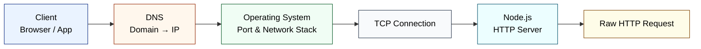
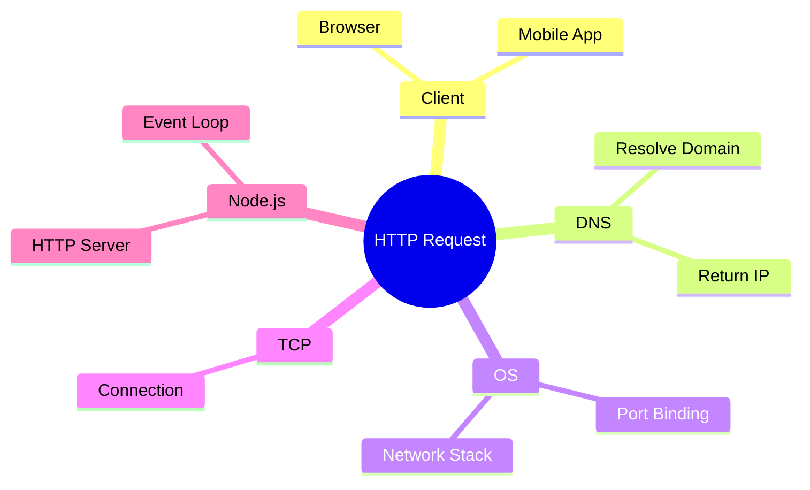
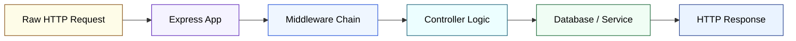
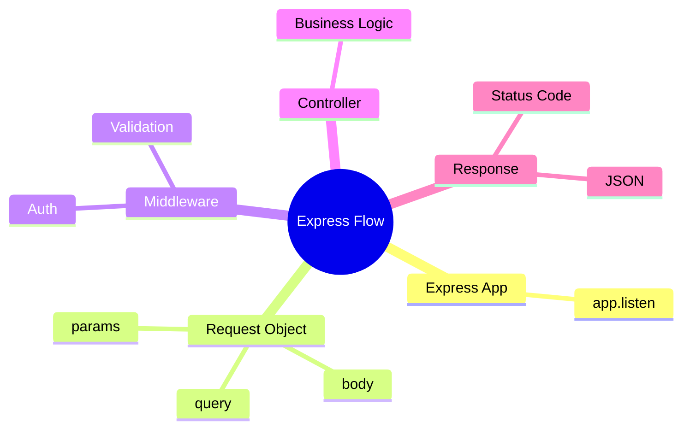

# 🔁 HTTP Request Lifecycle (Node.js + Express.js)

## 🧠 Big Picture
A client request goes through DNS and OS networking, reaches Node.js, then Express processes it and sends a response.

---

## ⚙️ Node.js Request Lifecycle (Low Level)

### 🔁 Horizontal Flowchart

### 🧠 Mind Map (Sequential & Clean)

### 📝 What Is Happening (Simple Explanation)

- User enters a URL in browser
- DNS converts domain name into IP address
- OS receives network data on a specific port
- TCP establishes a reliable connection
- Node.js HTTP server receives raw HTTP data

---

## 🚀 Express.js Request Lifecycle (High Level)

### 🔁 Horizontal Flowchart

### 🧠 Mind Map (Ordered, Not Random)

### 📝 What Is Happening (Simple Explanation)

- Node.js forwards request to Express
- Express creates `req` and `res` objects
- Middleware checks or modifies request
- Controller executes business logic
- Data is fetched or processed
- Response is sent back to client

---

## 🧪 One Simple Example

User hits: `GET /api/users/123`

- Browser sends request
- DNS resolves domain
- Node.js receives HTTP request
- Express middleware validates user
- Controller fetches user from DB
- JSON response is returned
