# 🔁 HTTP Request Lifecycle (Node.js + Express.js)

## 🧠 Big Picture (1 line)
Client request flows through DNS → OS → Node.js → Express middleware → controller → response.

---

## ⚙️ Node.js Request Lifecycle (Low-Level View)

### 🔁 Horizontal Flowchart (Execution Order)

```mermaid
flowchart LR
    A[1️⃣ Client<br/>Browser / App]:::client --> 
    B[2️⃣ DNS<br/>Domain → IP]:::infra --> 
    C[3️⃣ OS<br/>Port Binding]:::infra --> 
    D[4️⃣ TCP<br/>Connection]:::infra --> 
    E[5️⃣ Node.js<br/>HTTP Server]:::node --> 
    F[6️⃣ Raw HTTP<br/>Request]:::node

    classDef client fill:#E3F2FD,stroke:#1565C0,color:#000
    classDef infra fill:#FFF3E0,stroke:#EF6C00,color:#000
    classDef node fill:#E8F5E9,stroke:#2E7D32,color:#000
```

---

### 🧠 Structured Mind Map (Flow-Based, Not Random)

---

### 🔍 Click-to-Expand (Simulated Node Clicks)

1️⃣ Client

- Initiates HTTP request  
- Chooses method (GET/POST)  
- Sends URL and headers  

Related:
- REST
- HTTP methods

2️⃣ DNS

- Resolves domain name → IP address  
- Happens before TCP  
- Has no idea about ports  

Related:
- Recursive resolver
- Caching

3️⃣ OS

- Owns network stack  
- Binds ports to processes  
- Forwards data to Node.js  

Related:
- Sockets
- File descriptors

4️⃣ TCP

- Establishes reliable connection  
- Handles packet order & retransmission  

Related:
- 3-way handshake
- Keep-alive

5️⃣ Node.js

- Receives raw HTTP request  
- Uses non-blocking I/O  
- Pushes request into JS runtime  

Related:
- libuv
- Event loop phases

---

## 🚀 Express.js Request Lifecycle (High-Level View)

### 🔁 Horizontal Flowchart

```mermaid
flowchart LR
    A[1️⃣ Raw HTTP<br/>Request]:::node --> 
    B[2️⃣ Express<br/>App]:::express --> 
    C[3️⃣ Middleware<br/>Chain]:::express --> 
    D[4️⃣ Controller<br/>Logic]:::logic --> 
    E[5️⃣ DB / Service]:::logic --> 
    F[6️⃣ Response<br/>JSON]:::client

    classDef node fill:#E8F5E9,stroke:#2E7D32,color:#000
    classDef express fill:#F3E5F5,stroke:#6A1B9A,color:#000
    classDef logic fill:#E1F5FE,stroke:#0277BD,color:#000
    classDef client fill:#E3F2FD,stroke:#1565C0,color:#000
```

---

### 🧠 Express Mind Map (Hierarchical & Sequential)

---

### 🔍 Click-to-Expand (Simulated Interactive Nodes)

3️⃣ Middleware

- Functions with `(req, res, next)`  
- Runs in declared order  
- Can stop or forward request  

Related:
- Authentication
- Rate limiting

4️⃣ Controller

- Core business logic  
- Calls services / DB  
- Prepares response data  

Related:
- MVC
- Clean architecture

5️⃣ Response

- Ends request lifecycle  
- Sent using `res.send()` / `res.json()`  

Related:
- Status codes
- Headers

---

## 🧪 Rough Example (Same as Diagrams)

Click to expand

User opens browser → `GET /api/users/123`  
DNS resolves domain → IP  
OS routes to port 443  
Node.js receives raw HTTP  
Express middleware authenticates  
Controller fetches user  
Response sent as JSON  

---

## 💡 Why + Common Mistakes

Click to expand

**Why**
- Separation of concerns
- Scalable request handling
- Clean architecture

**Common Mistakes**
- Mixing Node.js & Express roles
- Forgetting `next()`
- Sending response twice
- Blocking event loop

